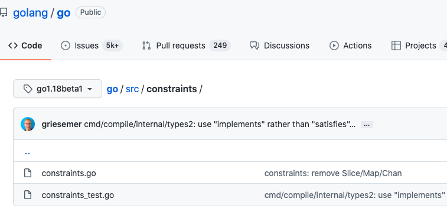

# Go 1.18将移除用于泛型的constraints包

## 背景

Go官方团队在Go 1.18 Beta 1版本的标准库里因为泛型设计而引入了`contraints`包。



`constraints`包里定义了`Signed`，`Unsigned`, `Integer`, `Float`, `Complex`和`Ordered`共6个interface类型，可以用于泛型里的类型约束(`type constraint`)。

比如我们可以用`constraints`包写出如下泛型代码：

```go
// test.go
package main

import (
	"constraints"
	"fmt"
)

// return the min value
func min[T constraints.Ordered](a, b T) T {
	fmt.Printf("%T ", a)
	if a < b {
		return a
	}
	return b
}

func main() {
	minInt := min(1, 2)
	fmt.Println(minInt)

	minFloat := min(1.0, 2.0)
	fmt.Println(minFloat)

	minStr := min("a", "b")
	fmt.Println(minStr)
}
```

函数`min`是一个泛型函数，接收2个参数，返回其中的较小者。

类型参数`T`的类型约束`contraints.Ordered`的定义如下：

```go
type Ordered interface {
	Integer | Float | ~string
}
```

上面代码的执行结果为：

```bash
int 1
float64 1
string a
```

**备注**：如果对Go泛型和`constraints`包还不太了解的同学，可以翻看我之前写的[一文读懂Go泛型设计和使用场景](https://mp.weixin.qq.com/s?__biz=Mzg2MTcwNjc1Mg==&mid=2247483731&idx=1&sn=b2258b28e2f3c16b065a5a1b22c15b0d&chksm=ce124e3cf965c72a6a22e0ed15deda8238567407bbd7157a79753fc8b605727ab2153009493c&token=1073108956&lang=zh_CN#rd)。


## 现状

Go官方团队的技术负责人Russ Cox在2022.01.25[提议](https://github.com/golang/go/issues/50792)将`constraints`包从Go标准库里移除，放到`x/exp`项目下。Russ Cox给出的理由如下：

> There are still questions about the the constraints package. To start with, although many people are happy with the name, [many are not](https://github.com/golang/go/issues/50348). On top of that, it is unclear exactly which interfaces are important and should be present and which should be not. More generally, all the considerations that [led us to move slices and maps to x/exp](https://groups.google.com/g/golang-dev/c/iuB22_G9Kbo/m/7B1jd1I3BQAJ) apply to constraints as well.
>
> We left constraints behind in the standard library because we believed it was fundamental to using generics, but in practice that hasn't proven to be the case. In particular, most code uses any or comparable. If those are the only common constraints, maybe we don't need the package. Or if constraints.Ordered is the only other commonly used constraint, maybe that should be a predeclared identifier next to any and comparable. The ability to [abbreviate simple constraints](https://github.com/golang/go/issues/48424) let us remove constraints.Chan, constraints.Map, and constraints.Slice, which probably would have been commonly used, but they're gone.
>
> Unlike other interfaces like, say, context.Context, there is no compatibility issue with having a constraint interface defined in multiple packages. The problems that happen with duplicate interfaces involve other types built using that type, such as `func(context.Context)` vs `func(othercontext.Context)`. But that cannot happen with constraints, because they can only appear as type parameters, and they are irrelevant to type equality for a particular substitution. So having x/exp/constraints and later having constraints does not cause any kind of migration problem at all, unlike what happened with context.
>
> For all these reasons, it probably makes sense to move constraints to x/exp along with slices and maps for Go 1.18 and then revisit it in the Go 1.19 or maybe Go 1.20 cycle. (Realistically, we may not know much more for Go 1.19 than we do now.)
>
> Discussed with [@robpike](https://github.com/robpike), [@griesemer](https://github.com/griesemer), and [@ianlancetaylor](https://github.com/ianlancetaylor), who all agree.

该提议也同Go语言发明者Rob Pike, Robert Griesemer和Ian Lance Taylor做过讨论，得到了他们的同意。

其中Robert Griesemer和Ian Lance Taylor是Go泛型的设计者。

Russ Cox将这个提议在GitHub公布后，社区成员没有反对意见，因此在2022.02.03这个提议得到正式通过。

不过值得注意的是，2022.01.31发布的Go 1.18 Beta 2版本里还保留了`constraints`包，不建议大家再去使用。

**备注**:

* `golang.org/x`下所有package的源码独立于Go源码的主干分支，也不在Go的二进制安装包里。如果需要使用`golang.org/x`下的package，可以使用`go get`来安装。
* `golang.org/x/exp`下的所有package都属于实验性质或者被废弃的package，不建议使用。


## 移除原因

支持泛型的Go 1.18 Beta 1版本发布以来，围绕着`constraints`包的争议很多。

主要是以下因素，导致Russ Cox决定从Go标准库中移除`constraints`包。

* `constraints`名字太长，代码写起来比较繁琐。
* 大多数泛型的代码只用到了`any`和`comparable`这2个类型约束。`constaints`包里只有`constraints.Ordered`使用比较广泛，其它很少用。所以完全可以把`Ordered`设计成和`any`以及`comparable`一样，都作为Go的预声明标识符，不用单独弄一个`constraints`包。


## 总结

建议不要使用`constraints`包，毕竟Go 1.18正式版本会去掉。

我写了2篇Go泛型入门的教程，欢迎大家参考

* [官方教程：Go泛型入门](https://mp.weixin.qq.com/s?__biz=Mzg2MTcwNjc1Mg==&mid=2247483720&idx=1&sn=57ec4877dfd364a59deacf1e74a4fb66&chksm=ce124e27f965c731432dcc89d1e0563cf84baaef482eaa068a91bee61f10cf85b433923b83b4&token=1073108956&lang=zh_CN#rd)
* [一文读懂Go泛型设计和使用场景](https://mp.weixin.qq.com/s?__biz=Mzg2MTcwNjc1Mg==&mid=2247483731&idx=1&sn=b2258b28e2f3c16b065a5a1b22c15b0d&chksm=ce124e3cf965c72a6a22e0ed15deda8238567407bbd7157a79753fc8b605727ab2153009493c&token=1073108956&lang=zh_CN#rd)


## 好文推荐

* [Go Quiz: Google工程师的Go语言面试题](https://mp.weixin.qq.com/s?__biz=Mzg2MTcwNjc1Mg==&mid=2247483826&idx=1&sn=867f05f3de482259a16369d5e7dff84f&chksm=ce124eddf965c7cb6fee82f567ac86bcf48aaf6bc7c2dc4261c0c9f8f13a2d6f6e060ccb9d16&token=1725113580&lang=zh_CN#rd)

* [Go Quiz: 从Go面试题看slice的底层原理和注意事项](https://mp.weixin.qq.com/s?__biz=Mzg2MTcwNjc1Mg==&mid=2247483741&idx=1&sn=486066a3a582faf457f91b8397178f64&chksm=ce124e32f965c72411e2f083c22531aa70bb7fa0946c505dc886fb054b2a644abde3ad7ea6a0&token=1073108956&lang=zh_CN#rd)

* [Go Quiz: 从Go面试题搞懂slice range遍历的坑](https://mp.weixin.qq.com/s?__biz=Mzg2MTcwNjc1Mg==&mid=2247483810&idx=1&sn=1f6ab90f481ef340cf48c2458a2a8682&chksm=ce124ecdf965c7dbbf26b331f3e316b9d376f8cd7d9190bfce0e9695593c8bb8b7e8ed06ed8c&token=1073108956&lang=zh_CN#rd)

* [Go Quiz: 从Go面试题看channel的注意事项](https://mp.weixin.qq.com/s?__biz=Mzg2MTcwNjc1Mg==&mid=2247483746&idx=1&sn=c3ec0e3f67fa7b1cb82e61450d10c7fd&chksm=ce124e0df965c71b7e148ac3ce05c82ffde4137cb901b16c2c9567f3f6ed03e4ff738866ad53&token=1073108956&lang=zh_CN#rd)

* [Go Quiz: 从Go面试题看channel在select场景下的注意事项](https://mp.weixin.qq.com/s?__biz=Mzg2MTcwNjc1Mg==&mid=2247483816&idx=1&sn=44e5cf4900b44f9a0cde491df5dd6e51&chksm=ce124ec7f965c7d1edd9ccffe80520981970ad6000cfea3b1a4099a4627f0f24cc33272ec996&token=1073108956&lang=zh_CN#rd)

* [Go Quiz: 从Go面试题看defer语义的底层原理和注意事项](https://mp.weixin.qq.com/s?__biz=Mzg2MTcwNjc1Mg==&mid=2247483756&idx=1&sn=d536fa3340e1d5f91d72eaa8b67c8123&chksm=ce124e03f965c715e26f5943948e17d8e0ebb3c4a3a180a149219a610f83fc6eb77b3b166b6a&token=1073108956&lang=zh_CN#rd)

* [Go Quiz: 从Go面试题看defer的注意事项第2篇](https://mp.weixin.qq.com/s?__biz=Mzg2MTcwNjc1Mg==&mid=2247483762&idx=1&sn=ca4235d28d513267aa082dc12cb37fda&chksm=ce124e1df965c70b06be48bc537bd628f3caf81e2837ebc2fbd0edddc6eb4f2b2c52e4d5c5d5&token=1073108956&lang=zh_CN#rd)

* [Go Quiz: 从Go面试题看defer的注意事项第3篇](https://mp.weixin.qq.com/s?__biz=Mzg2MTcwNjc1Mg==&mid=2247483821&idx=1&sn=2ebfb63b78f5fa3666ca6801985a5462&chksm=ce124ec2f965c7d441efbc0d40d0dd8b4d62c255f8ca0b093d106944adbca9a903e94eb92b19&token=1073108956&lang=zh_CN#rd)

* [Go Quiz: 从Go面试题看分号规则和switch的注意事项](https://mp.weixin.qq.com/s?__biz=Mzg2MTcwNjc1Mg==&mid=2247483750&idx=1&sn=235d959cd0401c2c4299f2ec1bbbfec9&chksm=ce124e09f965c71f1989ac9fe691af6a7697ba12a084d8cbdfe3966da1372f787d8e07c231a7&token=1073108956&lang=zh_CN#rd)

  

## 开源地址

文章和示例代码开源在GitHub: [Go语言初级、中级和高级教程](https://github.com/jincheng9/go-tutorial)。

公众号：coding进阶。关注公众号可以获取最新Go面试题和技术栈。

个人网站：[Jincheng's Blog](https://jincheng9.github.io/)。

知乎：[无忌](https://www.zhihu.com/people/thucuhkwuji)。


## References

* https://github.com/golang/go/issues/50792
* https://github.com/golang/go/issues/50348

* https://pkg.go.dev/golang.org/x